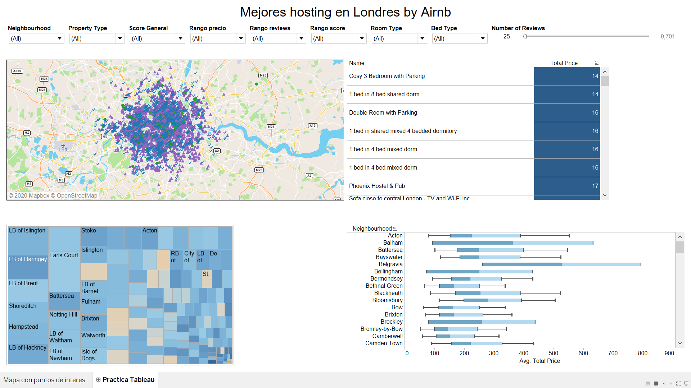
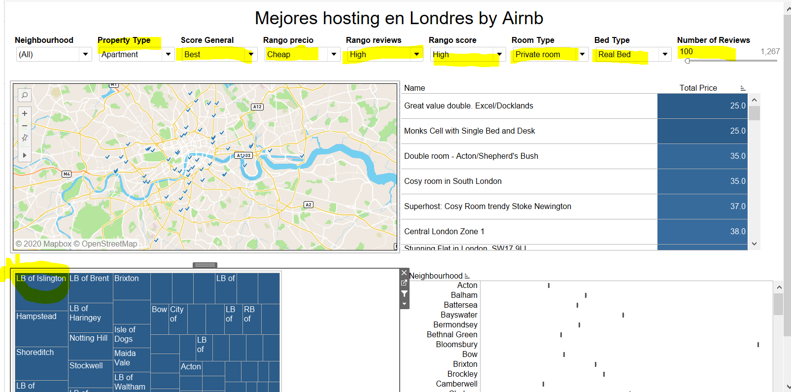

# Bootcamp Big Data and Machine Learning 5
# Exploracion y visualizacion de datos

---
# *Apartamentos para turistas en Londres*

## Idea general
Generar un ranking de los hosting Airnb de la ciudad de Londres, para ello tomaremos en consideracion el precio del host, la cantidad de reviews y la calificacion general.


## Estrategia de extraccion:
Para este ejercicio partimos del archivo csv extraido desde el web de airnb con el filtro de ciudad de londres y le hacemos el cleaning utlizando la herramienta tableau Prep.


## Estrategia de visualizacion:

Se presentan las clasificacion de los hosts por medio de 4 visualizaciones:

- Un mapa con la visualizacion de los hosts y diferenciando por color y forma la clasificacion general
- Luego temenos un listado con el nombre del host con su precio total
- La tercera visualizacion es un diagrama de arbol mostrando los scores en la plataforma por vecindario tomando en cuenta la cantidad de host en cada uno
- Finalmente un diagrama de bigotes con los rangos de precio de cada vecindario.



## Resultado del analisis visual:

Al jugar con las visualizaciones en tableau y filtrar los mejores host, con menor precio, mejor calificacion obtenemos que el mejor vecindario es "LB of Islington" y con el menor precio el hosting con el ID 4828854




